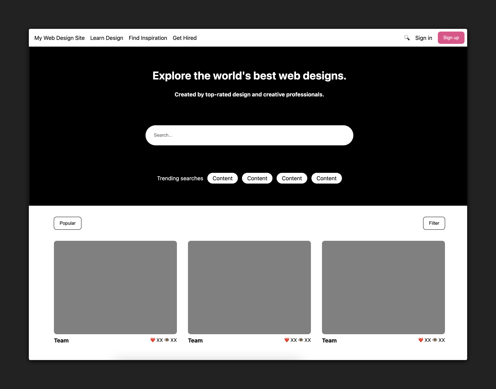
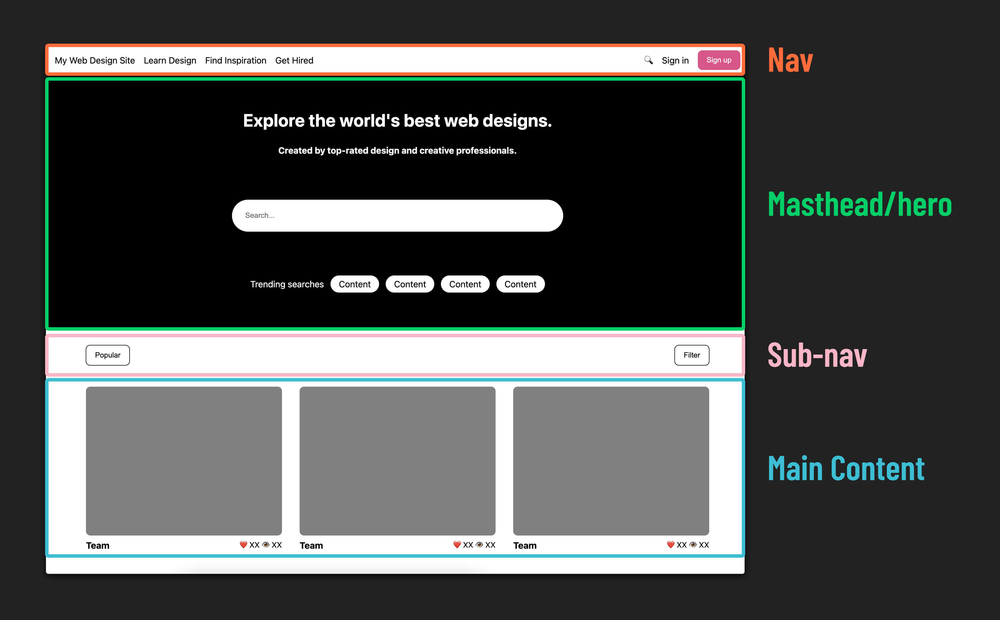
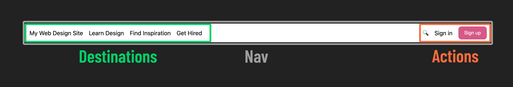
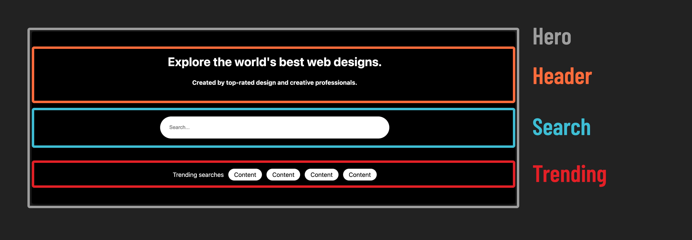
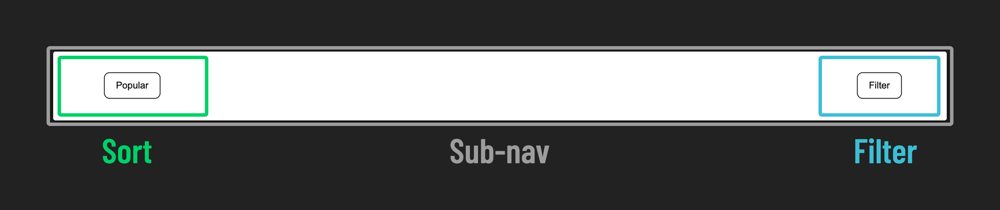
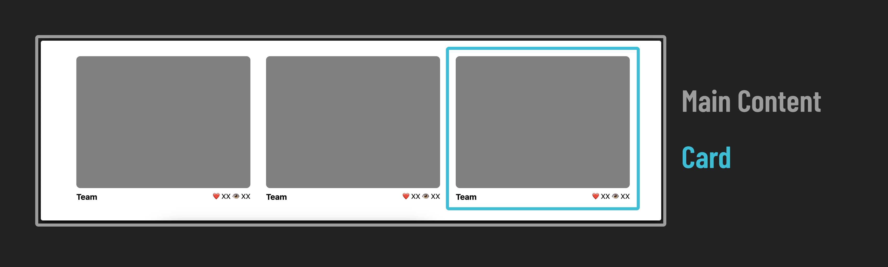
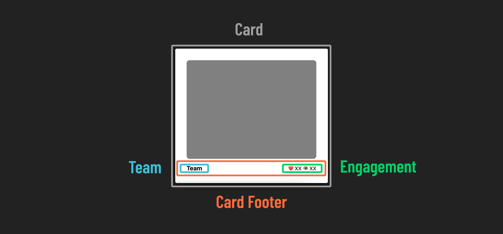

<h1>
  Flexbox Lab
  Exercise
</h1>

## Introduction

In this lab, you'll practice using flexbox to lay out pre-styled elements on a webpage.

### A quick note before you dive in

If you get stuck during the lab, we recommend revisiting the lesson materials first. They're designed to provide you with the information and examples that will help you complete the exercises.

**Key points from the lesson:**

- Flexbox properties set on parents primarily affect their immediate children.
- You can nest flexboxes within one another to create more complex layouts.
- Always consider the default behavior of elements compared to their behavior when placed inside a flexbox, and understand how to control that behavior.
- When in doubt, consult the [Complete Guide to Flexbox](https://css-tricks.com/snippets/css/a-guide-to-flexbox/) for detailed guidance and examples to assist you in this process.

This lab primarily covers layout and appearance, **_not functionality_**. Links, for instance, are represented as paragraph elements. Additionally, when working on your layout, add flexbox declarations to existing rules where possible, but be prepared to create new CSS rules when needed.

If you've revisited the lesson materials and are still facing challenges, don't hesitate to collaborate with your classmates.

Lastly, resources like [Google](https://www.google.com/), [MDN](https://developer.mozilla.org/en-US/docs/Learn/CSS/CSS_layout/Flexbox), [Stack Overflow](https://stackoverflow.com/search?q=flexbox), and especially [the Complete Guide to Flexbox](https://css-tricks.com/snippets/css/a-guide-to-flexbox/) are just a few clicks away. Use these before reaching out for help.

Happy coding!

## The final design

Let's begin by evaluating the final design. The end result should resemble the reference site shown below:

Here's a link to this page so you can explore it on your own:

🌐 [Live Example](https://pages.git.generalassemb.ly/modular-curriculum-all-courses/flexbox-lab-solution/)

## Approach

When styling a full page layout, trying to code the entire page all at once can be overwhelming and counterproductive. Instead, it's sometimes more helpful to break the final design into smaller sections that can each be worked on independently of one another.

There are four distinct sections of this webpage:

- The top nav
- The hero content
- The sub-nav
- The main content

This breakdown can be subjective, but the HTML structure of the page is often a good source of guidance. You'll notice these four sections correspond directly with the four child elements of `<body>`:

- The `<nav>` element corresponds to the nav bar.
- The `<section id="hero">` element corresponds to the hero content of the page.
- The `
` element corresponds to the sub-nav.
- The `<main>` element corresponds to the main content of the page.

Dividing a website into distinct sections is fundamental when working with flexbox. The process involves nesting elements within flex containers as needed. We'll begin with the Nav!

## Nav

Here's an example of the completed nav bar:

Examining this, we can broadly categorize the items on the left side as **_destinations_** and the items on the right side as potential user **_actions_**.

### Step 1 : Styling the Nav

Apply flexbox properties to recreate the nav bar layout shown in the example above.

Here are some hints to guide you:

- Convert the `<nav>`, `
`, and `
` elements into flex containers. Keep in mind that this makes `
` and `
` both flex children (inside `<nav>`) and flex parents to their own child elements.
- Research a method to create spacing between the elements inside `
` and `
`.
- Vertically centering `destinations` and `actions` within the nav bar may pose a challenge. Break down the problem into smaller steps and tackle them one by one.

> 🧠 Look familiar? This is a widely used design pattern in websites, and it feels intuitive for a reason. Pay attention to common design patterns, and apply this knowledge to enhance user experiences in your own projects.

## Hero

Next, let's examine the components of our hero section:

### Step 2 : Center items in the hero

- Apply flexbox properties to recreate the hero layout shown in the example above.
- Similar to what you did for the nav bar, you'll need to nest one flexbox inside another to achieve the desired result.

> ❓ What's different about how the Hero section positions its children compared to the nav?

## Sub Nav

Now for the sub-nav:

### Step 3 : Dividing the sub nav

- Use flexbox to position content on opposite sides of the sub nav.

## Main Content

Time for the main event! Everything has led up to this, and it's time to style the cards for the main content!

The main section is a scrolling list of cards, each with an image and a footer providing details about the piece of content.

### Step 4 : Create card layout

Apply flexbox properties to recreate the card layout shown in the example above.

Here are some hints to guide you:

- Make the `<main>` element a flex container that arranges its children in a row. When the children don't fit on one row, they should wrap to the next row.
- Ensure that the cards are vertically centered within the `<main>` element.
- Transform the `
` element into a flex container that arranges its children in a row. Position its two children at the edges of the container.
- Create spacing between the `<article class="card">` elements, which are children of the `<main>` element.

## Check your work

With your site complete, your finished product should look something like this:

🎉 Congrats, you did it!
