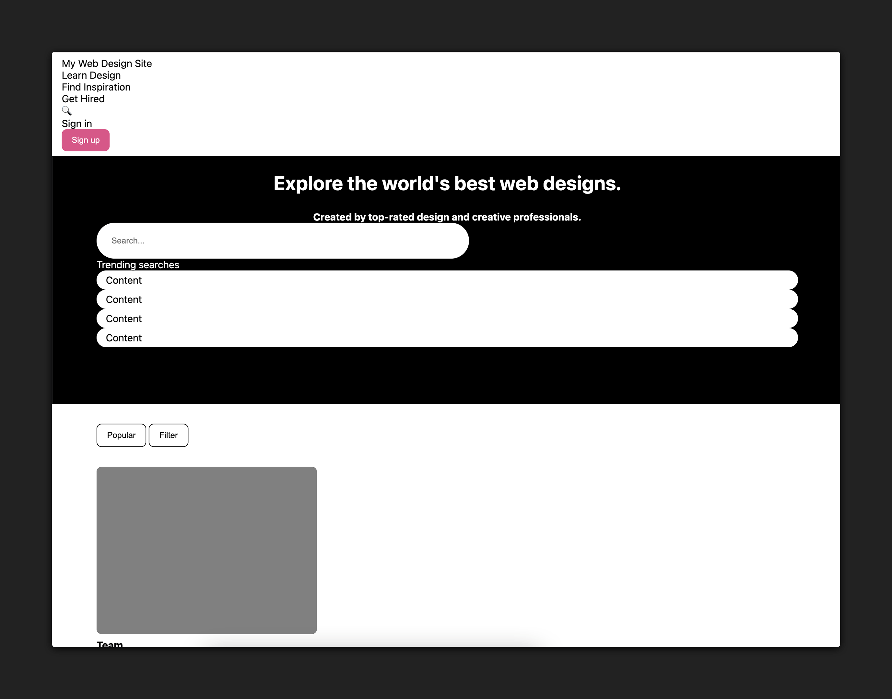

<h1>
  <span class="headline">Flexbox Lab</span>
  <span class="subhead">Setup</span>
</h1>

## Setup 

Fork this repository.

Clone your newly created repo into your `~/code/ga/labs` directory with the `git clone` command:

```bash
git clone https://github.com/<your-username>/u1-flexbox-lab.git
```


> Note: In the link above, where it says `<your-username>`, you should see the username from your GitHub account.

Next, `cd` into your new cloned directory, `u1-flexbox-lab`:

```bash
cd u1-flexbox-lab
```

Create a folder called `css`:

```bash
mkdir css
```

Then, create an `index.html` file and a `style.css` file that lives inside the `css` folder. These files will hold your work for this lab:

```bash
touch index.html ./css/style.css
```

With the files created, open the contents of the directory in VS Code:

```bash
code .
```

Open the `index.html` file and add HTML boilerplate by typing `!` and then hitting the `Tab` key. Then link the `style.css` file by adding this line inside the `<head>` tag:

```html
<link rel="stylesheet" href="./css/style.css">
```

Copy the following HTML and place it inside the `<body>`:

```html
  <nav>
    <div id="destinations">
      <p>My Web Design Site</p>
      <p>Learn Design</p>
      <p>Find Inspiration</p>
      <p>Get Hired</p>
    </div>
    <div id="actions">
      <p>🔍</p>
      <p>Sign in</p>
      <button>Sign up</button>
    </div>
  </nav>
  <section id="hero">
    <div id="headers">
      <h1>Explore the world's best web designs.</h1>
      <h2>Created by top-rated design and creative professionals.</h2>
    </div>
    <input type="text" placeholder="Search..."/>
    <div id="trending">
      Trending searches
      <p>Content</p>
      <p>Content</p>
      <p>Content</p>
      <p>Content</p>
    </div>
  </section>
  <div id="subnav">
    <button id="sort">Popular</button>
    <button id="filter">Filter</button>
  </div>
  <main>
    <article class="card">
      <div class="img-placeholder"></div>
      <div class="card-footer">
        <h3>Team</h3>
        <p>❤️ XX 👁️ XX</p>
      </div>
    </article>
    <article class="card">
      <div class="img-placeholder"></div>
      <div class="card-footer">
        <h3>Team</h3>
        <p>❤️ XX 👁️ XX</p>
      </div>
    </article>
    <article class="card">
      <div class="img-placeholder"></div>
      <div class="card-footer">
        <h3>Team</h3>
        <p>❤️ XX 👁️ XX</p>
      </div>
    </article>
    <article class="card">
      <div class="img-placeholder"></div>
      <div class="card-footer">
        <h3>Team</h3>
        <p>❤️ XX 👁️ XX</p>
      </div>
    </article>
    <article class="card">
      <div class="img-placeholder"></div>
      <div class="card-footer">
        <h3>Team</h3>
        <p>❤️ XX 👁️ XX</p>
      </div>
    </article>
    <article class="card">
      <div class="img-placeholder"></div>
      <div class="card-footer">
        <h3>Team</h3>
        <p>❤️ XX 👁️ XX</p>
      </div>
    </article>
    <article class="card">
      <div class="img-placeholder"></div>
      <div class="card-footer">
        <h3>Team</h3>
        <p>❤️ XX 👁️ XX</p>
      </div>
    </article>
    <article class="card">
      <div class="img-placeholder"></div>
      <div class="card-footer">
        <h3>Team</h3>
        <p>❤️ XX 👁️ XX</p>
      </div>
    </article>
  </main>
```

Add the following to `css/style.css`:

```css
* {
  box-sizing: border-box;
}

body {
  background-color: gray;
  font-family: system-ui, sans-serif;
  margin: 0;
}

nav {
  background-color: white;
  padding: 8px 16px;
}

p {
  margin: 0;
}

section {
  height: 460px;
  background-color: black;
  color: white;
  padding: 24px 72px;
}

h1,
h2 {
  text-align: center;
}

h1 {
  margin-top: 0;
  font-size: 32px;
}

h2 {
  font-size: 16px;
  margin-bottom: 0;
}

input {
  height: 58px;
  width: 80%;
  max-width: 600px;
  border-radius: 29px;
  border: 0px;
  padding: 0 24px;
}

main {
  background-color: white;
  padding: 32px 72px;
}

nav button {
  background-color: #ea4c89;
  border-radius: 8px;
  padding: 10px 16px;
  border: 0;
  color: #ffffff;
  font-weight: 500;
}

.img-placeholder {
  width: 355px;
  height: 270px;
  background-color: gray;
  border-radius: 8px;
}

.card-footer {
  font-size: 14px;
}

.card-footer * {
  margin-top: 8px;
}

#subnav {
  padding: 32px 72px 0;
  background-color: white;
}

#subnav button {
  border-radius: 8px;
  padding: 10px 16px;
  border: 1px solid black;
  background-color: white;
}

#trending p {
  background-color: white;
  color: black;
  border-radius: 50px;
  padding: 6px 15px;
}
```

Open the `index.html` file in your browser.

You should see something that looks like the following in your browser:



As you can see, all the elements have been styled but need to be laid out properly in flex containers to finalize this design. That is the work you'll do in the remainder of this lab. 

Feel free to explore the starter code, and the styling applied to this page so far, but don't modify any of the code now. 
